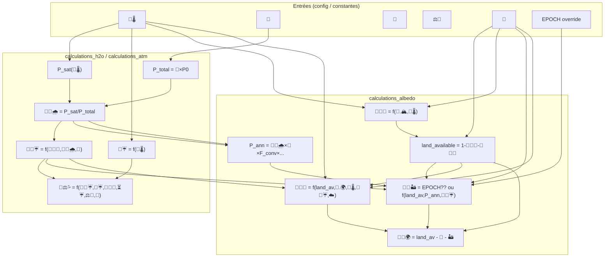

# Graphe des dépendances des variables qui peuvent être NaN

## Variables concernées
- 🍰🧮🌧 (fraction vapeur max)
- 💭☔ (seuil précipitations)
- 🍰⚖️💦 (taux précipitation kg/m²/s)
- 🍰🪩🏜️ (couverture désert)
- 🍰🪩🌳 (couverture forêt)
- 🍰🪩🧊 (couverture glace)
- 🍰🪩🌍 (couverture terres)

---

## Schéma Mermaid (à rendre dans un viewer Mermaid ou sur GitHub)



---

## Chaînes de dépendance (texte)

### 1. 🍰🧮🌧
- **Calcul** : `P_sat / P_total` avec `P_total = 🎈 × STANDARD_ATMOSPHERE_PA`
- **Dépend de** : 🧮🌡️ (via P_sat), 🎈
- **🎈** dépend de : ⚖️🫧, 🍎, 📐 (calculatePressureAtm)
- **→ NaN si** : 🎈=0 ou NaN, ou P_total=0 → division par zéro

### 2. 💭☔
- **Calcul** : `clamp(0.75 + 0.05 × (🧮🌡️ - EVAPORATION_T_REF) / EVAPORATION_T_SCALE, 0.7, 0.95)`
- **Dépend de** : 🧮🌡️
- **→ NaN si** : 🧮🌡️ est NaN ou undefined

### 3. 🍰⚖️💦
- **Calcul** : `(🍰🫧☔ - 💭☔) × 🍰🫧💧 × ⏳☔ × vapor_mass_per_m2` avec `vapor_mass_per_m2 = (🍰🫧💧 × ⚖️🫧) / surface`
- **Dépend de** : 🍰🫧☔, 💭☔, 🍰🫧💧, ⏳☔, ⚖️🫧, 📐
- **→ NaN si** : 💭☔ NaN, ou 🍰🫧☔ NaN, ou surface=0, ou autre entrée NaN

### 4. 🍰🪩🧊
- **Calcul** : `min(🗻.🍰🗻🏔, 0.46 × (T_no_ice_K - 🧮🌡️) / T_NO_POLAR_ICE_C)`
- **Dépend de** : 🗻.🍰🗻🏔, 🧮🌡️
- **→ NaN si** : 🧮🌡️ NaN

### 5. 🍰🪩🏜️
- **Calcul** : `EPOCH['🍰🪩🏜️'] ?? min(land_available, desert_base + variability_term)`
- **desert_base** = land_available × precip_factor × humidity_factor
- **P_ann** = 🍰🧮🌧 × ocean_coverage × F_conv × 200000
- **Dépend de** : EPOCH override, land_available, 🍰🧮🌧, 🍰🫧☔, 🧮🌡️
- **→ NaN si** : 🍰🧮🌧 NaN ou 🍰🫧☔ NaN (et pas d’override)

### 6. 🍰🪩🌳
- **Calcul** : `min(land_available, 🗻.🍰🗻🌍 × temp_factor × humidity_factor × cloud_factor × 0.6)`
- **Dépend de** : land_available, 🗻.🍰🗻🌍, 🧮🌡️, 🍰🫧☔, ☁️
- **→ NaN si** : 🍰🫧☔ NaN ou 🧮🌡️ NaN ou ☁️ NaN

### 7. 🍰🪩🌍
- **Calcul** : `land_available - 🍰🪩🌳 - 🍰🪩🏜️`
- **Dépend de** : land_available, 🍰🪩🌳, 🍰🪩🏜️
- **→ NaN si** : 🍰🪩🌳 ou 🍰🪩🏜️ est NaN

---

## Racine probable des NaN (d’après les logs)

En **phase non-Init**, dans la boucle de convergence :
- `calculatePrecipitationFeedback()` est appelé **sans** repasser par `calculateH2OParametersWithIteration` ni par `calculateCloudFormationIndex` au bon moment avec les bonnes données.
- Ou alors **🧮🌡️** est modifié (ex. pendant la dichotomie) et n’est pas défini / devient NaN dans certains chemins.
- Les logs montrent : `🍰🫧☔=0.0000 | 💭☔=NaN | 🍰⚖️💦=NaN` → `calculateCloudFormationIndex` est appelé depuis `calculatePrecipitationFeedback`, mais **💭☔** et **🍰⚖️💦** sont lus **avant** cet appel, ou l’époque/index utilisée pointe vers des DATA partiellement réinitialisées (ex. 🧮🌡️ manquant ou NaN).

**Ordre d’appel à vérifier** :  
`calculatePrecipitationFeedback` appelle `calculateCloudFormationIndex()` en premier, donc 💭☔ et 🍰⚖️💦 devraient être recalculés. Les NaN viennent sans doute du fait que, dans ce contexte, **DATA['🧮']['🧮🌡️']** est NaN ou que **DATA['📜']['👉']** (index d’époque) est incorrect, ce qui fausse 🎈, 📐, ou d’autres entrées de `calculateCloudFormationIndex`.

---

## Résumé visuel simplifié

```
🧮🌡️ ──┬──► 🍰🧮🌧 (via P_sat, 🎈)
       ├──► 💭☔
       ├──► 🍰🪩🧊
       └──► 🍰🪩🌳 (via temp_factor)

🎈 ────────► 🍰🧮🌧 (via P_total)

🍰🧮🌧 ────► P_ann ──► 🍰🪩🏜️
🍰🧮🌧 ────► 🍰🫧☔ (via q_sat)

🍰🫧☔ ────► 🍰🪩🏜️, 🍰🪩🌳
💭☔ ───────► 🍰⚖️💦

land_available ──► 🍰🪩🏜️, 🍰🪩🌳, 🍰🪩🌍
🍰🪩🌳 ──────────► 🍰🪩🌍
🍰🪩🏜️ ──────────► 🍰🪩🌍
```

**Proposition de diagnostic** : quand 💭☔ ou 🍰⚖️💦 deviennent NaN, logger **DATA['🧮']['🧮🌡️']** et **DATA['📜']['👉']** au tout début de `calculateCloudFormationIndex()`, pour vérifier que la température et l’époque sont bien définis à cet instant.
